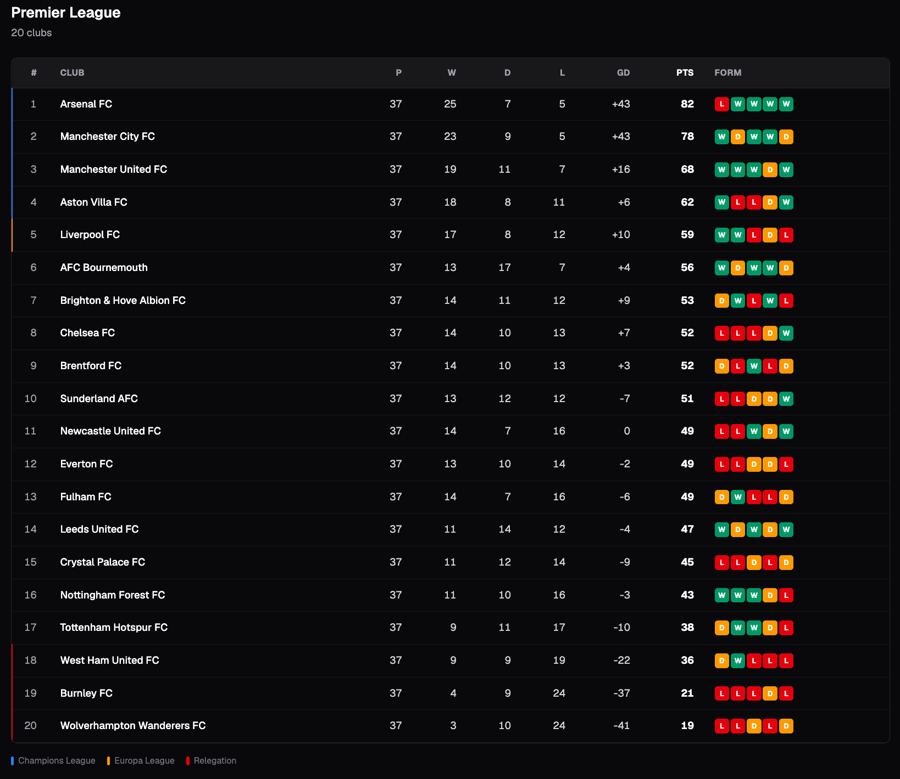

# FootyLens

A football match analysis platform that collects, processes, and visualises soccer data. FootyLens pulls live data from [Football-Data.org](https://www.football-data.org/), stores it in PostgreSQL via Django, computes analytics (xG proxy, form, top scorers) in a FastAPI layer, and presents everything in a Next.js dashboard.

Built as a portfolio project demonstrating a production-grade multi-service Python + TypeScript stack.

---

## Architecture

```
┌─────────────────────────────────────────────────────────────────┐
│                          Browser                                │
└──────────────────────────┬──────────────────────────────────────┘
                           │ HTTP :3000
┌──────────────────────────▼──────────────────────────────────────┐
│                    Next.js 16  (App Router)                     │
│          Server Components · ISR · Tailwind CSS v4              │
└──────┬─────────────────────────────────────┬────────────────────┘
       │ HTTP :8000                          │ HTTP :8001
┌──────▼────────────────┐     ┌─────────────▼──────────────────── ┐
│   FastAPI  (async)    │     │        Django + DRF               │
│  Data ingestion       │     │  ORM · Admin · JWT auth           │
│  Analytics endpoints  │     │  REST API (competitions,          │
│  APScheduler jobs     │     │  matches, teams, standings)       │
│  In-memory TTL cache  │     │  management commands              │
└──────┬────────────────┘     └──────────────┬─────────────────── ┘
       │                                     │
       │  rate-limited (10 req/min)          │ SQL
       ▼                                     ▼
Football-Data.org API          ┌─────────────────────────┐
                               │     PostgreSQL 16        │
                               └─────────────────────────┘
       │ TTL cache 1h/24h
       ▼
┌──────────────┐
│  Redis  7    │
└──────────────┘
```

**Service boundaries:**

| Service | Owns |
|---|---|
| FastAPI `:8000` | Async data fetching, rate limiting, analytics computation, cache |
| Django `:8001` | ORM, admin UI, DRF REST API, JWT auth, management commands |
| Next.js `:3000` | Server-side rendering, dashboard UI |
| PostgreSQL | Persistent storage — competitions, matches, teams, standings, players |
| Redis | FastAPI in-memory cache (standings 1h, historical stats 24h) |

---

## Features

- **Standings table** — live Premier League table with W/D/L record, goal difference, points, and last-5 form badges colour-coded green/amber/red
- **Matches** — fixture results grouped by matchday; falls back to most recent completed or upcoming matchday when outside the live window
- **xG proxy** — per-match expected goals estimated from a Poisson strength model (`attack_index × defence_index × league_avg`) derived from current season standings; displayed as a split horizontal bar chart
- **Form table** — last-N results per team with points tally
- **Top scorers** — ranked by goals, with assists, penalties, appearances, and goals-per-game rate
- **Django Admin** — full CRUD over all models, customised list displays and filters
- **JWT authentication** — Bearer token auth on the DRF API
- **Data sync command** — `sync_football_data` management command syncs competition, teams, squad, standings, and matches idempotently; respects the 10 calls/min free-tier limit

---

## Tech Stack

| Technology | Role | Why |
|---|---|---|
| **FastAPI** | Analytics API | Async-native, Pydantic validation at the boundary, ideal for IO-bound data fetching |
| **Django + DRF** | Main REST API & Admin | Battle-tested ORM, first-class admin UI, serializer/viewset pattern reduces boilerplate |
| **PostgreSQL 16** | Primary datastore | Relational model fits the FK-heavy football data schema naturally |
| **Redis 7** | API response cache | Respects Football-Data.org free tier (10 req/min) by serving cached responses for up to 24h |
| **APScheduler** | Background jobs | Lightweight in-process scheduler for periodic cache refresh inside FastAPI |
| **Next.js 16** | Frontend | App Router server components fetch data without client-side waterfalls; `force-dynamic` ensures runtime env vars are read |
| **Tailwind CSS v4** | Styling | Utility-first, zero-config dark theme, no design-system overhead |
| **TypeScript** | Frontend types | Interfaces mirror FastAPI Pydantic schemas, catching field name mismatches at compile time |
| **Docker Compose** | Local orchestration | Single `docker compose up --build` boots all five services with health-checked dependency ordering |

---

## Local Development Setup

### Prerequisites

- Python 3.13+
- Node.js 20+
- PostgreSQL 16 running locally
- Redis running locally
- A [Football-Data.org API key](https://www.football-data.org/client/register) (free tier)

### 1. Clone and configure

```bash
git clone https://github.com/suheum-heo/footylens.git
cd footylens
cp .env.example .env
# Edit .env — set FOOTBALL_DATA_API_KEY and DJANGO_SECRET_KEY at minimum
```

### 2. Python virtual environment

```bash
python -m venv .venv
source .venv/bin/activate
pip install -r services/fastapi/requirements.txt
pip install -r services/django/requirements.txt
```

### 3. Database setup

```bash
createdb footylens_db
cd services/django
python manage.py migrate
python manage.py createsuperuser
```

### 4. Start services

Open three terminal windows, each with `.venv` activated:

```bash
# Terminal 1 — FastAPI (port 8000)
cd services/fastapi
uvicorn main:app --reload --port 8000

# Terminal 2 — Django (port 8001)
cd services/django
python manage.py runserver 8001

# Terminal 3 — Next.js (port 3000)
cd services/nextjs
npm install
FASTAPI_URL=http://localhost:8000 npm run dev
```

### 5. Seed data

```bash
cd services/django
python manage.py sync_football_data --competition PL
# Full season + player squads:
python manage.py sync_football_data --competition PL --full
```

### 6. Verify

| URL | Expected |
|---|---|
| `http://localhost:3000` | Standings dashboard |
| `http://localhost:8000/docs` | FastAPI Swagger UI |
| `http://localhost:8001/admin` | Django Admin |
| `http://localhost:8001/api/matches/` | DRF browsable API |

---

## Docker Setup

### Requirements

- Docker Desktop (or Docker Engine + Compose plugin)
- `.env` file with `FOOTBALL_DATA_API_KEY` and `DJANGO_SECRET_KEY` set

### Start everything

```bash
docker compose up --build
```

Services start in dependency order: `postgres` + `redis` → `fastapi` + `django` → `nextjs`. All have health checks.

### First-time setup

```bash
# Run Django migrations
docker compose exec django python manage.py migrate

# Create an admin user
docker compose exec django python manage.py createsuperuser

# Sync Premier League data
docker compose exec django python manage.py sync_football_data --competition PL

# Full sync (includes player squads — makes more API calls)
docker compose exec django python manage.py sync_football_data --competition PL --full
```

### Useful commands

```bash
# Tail logs for a specific service
docker compose logs -f fastapi

# Stop everything, preserve data volumes
docker compose down

# Stop and wipe the database
docker compose down -v

# Rebuild a single service after code changes
docker compose build nextjs && docker compose up -d nextjs
```

### Ports

| Service | Local port |
|---|---|
| Next.js dashboard | `http://localhost:3000` |
| FastAPI | `http://localhost:8000` |
| Django / Admin | `http://localhost:8001` |
| PostgreSQL | `5432` (internal only) |
| Redis | `6379` (internal only) |

---

## API Reference

### FastAPI (`:8000`) — Analytics & data ingestion

All endpoints are read-only and cached. Interactive docs at `/docs`.

#### Matches

```
GET /api/matches?competition=PL
GET /api/matches?competition=PL&matchday=38
GET /api/matches?competition=PL&status=FINISHED
```

`status` values: `SCHEDULED`, `TIMED`, `IN_PLAY`, `PAUSED`, `FINISHED`, `POSTPONED`, `CANCELLED`

#### Standings

```
GET /api/standings?competition=PL
```

Returns the TOTAL league table for the current season.

#### Teams

```
GET /api/teams?competition=PL
```

#### Analytics

```
GET /api/analytics/xg?competition=PL&matchday=38
GET /api/analytics/standings-form?competition=PL&last_n=5
GET /api/analytics/top-scorers?competition=PL&limit=20
```

#### Cache

```
GET  /api/cache/status    # Cache hit/miss stats and scheduler jobs
DELETE /api/cache/clear   # Flush all cached entries
```

Competition codes: `PL` (Premier League), `BL1` (Bundesliga), `SA` (Serie A), `PD` (La Liga), `FL1` (Ligue 1)

---

### Django DRF (`:8001`) — Persistent data API

Full REST API with pagination (`page_size=20`). Browsable at `/api/`.

Read-only for unauthenticated requests; JWT required for write operations.

```
GET  /api/competitions/
GET  /api/competitions/{id}/

GET  /api/matches/
GET  /api/matches/{id}/

GET  /api/teams/
GET  /api/teams/{id}/

GET  /api/standings/
GET  /api/standings/{id}/
```

#### Authentication

```
POST /api/auth/token/           # Obtain JWT pair  { username, password }
POST /api/auth/token/refresh/   # Refresh access token  { refresh }
```

Access tokens expire after **1 hour**; refresh tokens after **7 days**.

Include the token in subsequent requests:

```
Authorization: Bearer <access_token>
```

---

## Project Structure

```
footylens/
├── docker-compose.yml          # Five-service orchestration
├── .env.example                # Environment variable template
├── CLAUDE.md                   # AI assistant instructions
├── tasks/                      # Development planning notes
│
└── services/
    │
    ├── fastapi/                # Analytics & data ingestion service
    │   ├── Dockerfile
    │   ├── requirements.txt
    │   ├── main.py             # App factory, lifespan, health endpoint
    │   ├── core/
    │   │   └── config.py       # Pydantic settings (reads .env)
    │   ├── models/
    │   │   └── football_data.py # Pydantic models for API responses
    │   ├── schemas/
    │   │   └── responses.py    # FastAPI response schemas
    │   ├── routers/
    │   │   ├── matches.py      # GET /api/matches
    │   │   ├── standings.py    # GET /api/standings
    │   │   ├── teams.py        # GET /api/teams
    │   │   ├── analytics.py    # GET /api/analytics/*
    │   │   └── cache_status.py # GET /api/cache/status
    │   └── services/
    │       ├── football_data_client.py  # Rate-limited async HTTP client
    │       ├── client_factory.py        # Shared FastAPI dependency
    │       ├── analytics_engine.py      # xG, form, scorers computation
    │       └── scheduler.py             # APScheduler background jobs
    │
    ├── django/                 # Main REST API & admin service
    │   ├── Dockerfile
    │   ├── requirements.txt
    │   ├── manage.py
    │   ├── footylens/
    │   │   ├── settings.py     # Django + DRF + JWT + Redis config
    │   │   └── urls.py         # Root URL routing
    │   ├── accounts/
    │   │   └── models.py       # Custom User (AbstractUser)
    │   ├── matches/
    │   │   ├── models.py       # Competition, Match
    │   │   ├── serializers.py
    │   │   ├── views.py        # ReadOnlyModelViewSet
    │   │   ├── admin.py
    │   │   └── management/commands/
    │   │       └── sync_football_data.py  # Data sync command
    │   ├── teams/
    │   │   ├── models.py       # Team, Player
    │   │   ├── serializers.py
    │   │   ├── views.py
    │   │   └── admin.py
    │   └── standings/
    │       ├── models.py       # Standing, TableEntry
    │       ├── serializers.py
    │       ├── views.py
    │       └── admin.py
    │
    └── nextjs/                 # Dashboard frontend
        ├── Dockerfile          # Multi-stage build (standalone output)
        ├── next.config.ts
        ├── app/
        │   ├── layout.tsx      # Root layout with sidebar nav
        │   ├── page.tsx        # / — Standings + form badges
        │   ├── matches/
        │   │   └── page.tsx    # /matches — Fixtures & results
        │   └── analytics/
        │       └── page.tsx    # /analytics — xG chart + scorers
        ├── components/
        │   ├── Nav.tsx         # Client component, usePathname active state
        │   └── FormBadge.tsx   # W/D/L coloured chips
        ├── lib/
        │   └── api.ts          # Typed fetch helpers (server-side only)
        └── types/
            └── api.ts          # TypeScript interfaces matching FastAPI schemas
```

---

## Screenshots

> Add screenshots to a `docs/screenshots/` directory and update the paths below.

| Page | Screenshot |
|---|---|
| Standings | `docs/screenshots/standings.png` |
| Matches | `docs/screenshots/matches.png` |
| Analytics — xG chart | `docs/screenshots/analytics-xg.png` |
| Analytics — Top scorers | `docs/screenshots/analytics-scorers.png` |
| Django Admin | `docs/screenshots/admin.png` |

To add screenshots:
```bash
mkdir -p docs/screenshots
# Take screenshots and save them to docs/screenshots/
# Then update the table above with the actual image paths:
# 
```

---

## Environment Variables

Copy `.env.example` to `.env` and fill in the required values.

| Variable | Required | Default | Description |
|---|---|---|---|
| `FOOTBALL_DATA_API_KEY` | Yes | — | [football-data.org](https://www.football-data.org/client/register) API key |
| `DJANGO_SECRET_KEY` | Yes | — | Django secret key (generate with `python -c "from django.core.management.utils import get_random_secret_key; print(get_random_secret_key())"`) |
| `DATABASE_URL` | Yes | `postgres://...localhost.../footylens_db` | PostgreSQL connection string |
| `REDIS_URL` | Yes | `redis://localhost:6379/1` | Redis connection string |
| `DJANGO_DEBUG` | No | `True` | Set to `False` in production |
| `DJANGO_ALLOWED_HOSTS` | No | `localhost,127.0.0.1` | Comma-separated allowed hosts |
| `FASTAPI_DEBUG` | No | `True` | FastAPI debug mode |
| `RATE_LIMIT_REQUESTS` | No | `10` | Max API calls per period |
| `RATE_LIMIT_PERIOD_SECONDS` | No | `60` | Rate limit window |
| `FASTAPI_URL` | Next.js only | `http://localhost:8000` | FastAPI base URL (set to `http://fastapi:8000` in Docker) |

---

## Data Sync

The `sync_football_data` management command is the bridge between Football-Data.org and the PostgreSQL database. It runs idempotently — safe to re-run at any time.

```bash
# Basic sync — competition, teams, standings, current window matches
python manage.py sync_football_data --competition PL

# Specific matchday
python manage.py sync_football_data --competition PL --matchday 38

# Full season — all matches + player squads (more API calls)
python manage.py sync_football_data --competition PL --full
```

Supported competition codes: `PL`, `BL1`, `SA`, `PD`, `FL1`, `CL`

The command sleeps 7 seconds between API calls to stay within the free-tier 10 calls/minute limit. A full sync (`--full`) takes approximately 30–35 seconds.

---

## License

MIT
